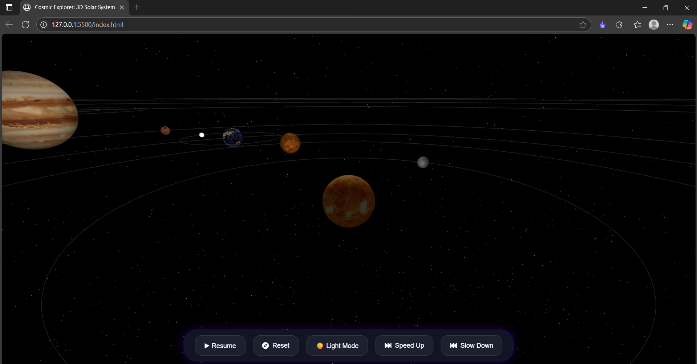

# 🌌 Cosmic Explorer: 3D Solar System


*Real-time 3D rendering of our solar system with interactive controls*

## 🚀 Features

- **Photorealistic 3D Planets** with accurate relative sizes and textures
- **Orbital Mechanics** showing proper planet rotations and revolutions
- **Interactive Controls**:
  - ⏸️ Pause/Resume simulation
  - ↻ Reset camera view
  - ☀️ Toggle light/dark mode
  - ⏩ Speed controls
- **Educational Info Panel** with planetary facts
- **Responsive Design** works on desktop, tablet & mobile
- **Optimized Performance** using Three.js and WebGL

## 🌟 Live Demo

[Experience the Solar System](https://cosmicexplorer3dsolarsystem.vercel.app/)

## 🛠️ Installation

```bash
# Clone the repository
git clone https://github.com/Om-Kumar-Ace/solar-system

# Navigate to project directory
cd solar-system-3d

# Install dependencies (if any)
 npm init -y       
 npm install three
 npm install three-orbitcontrols